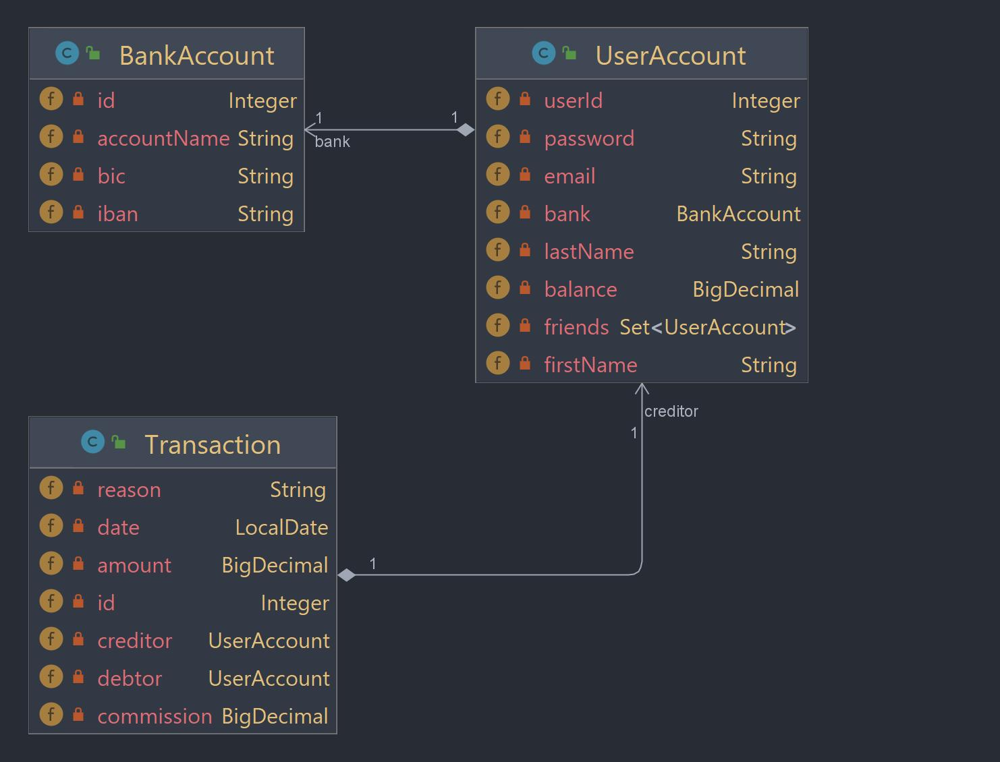
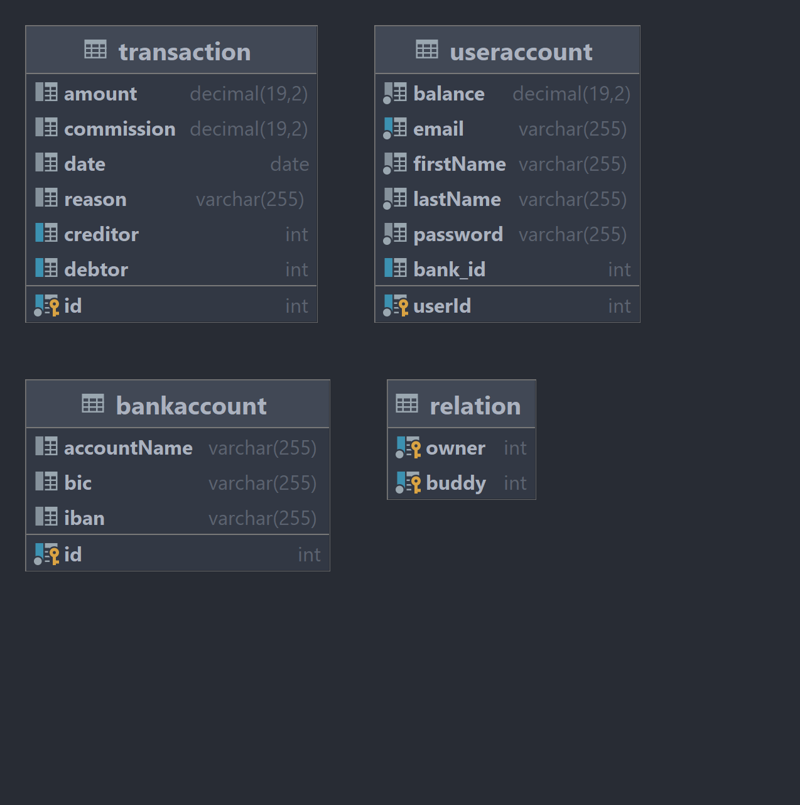
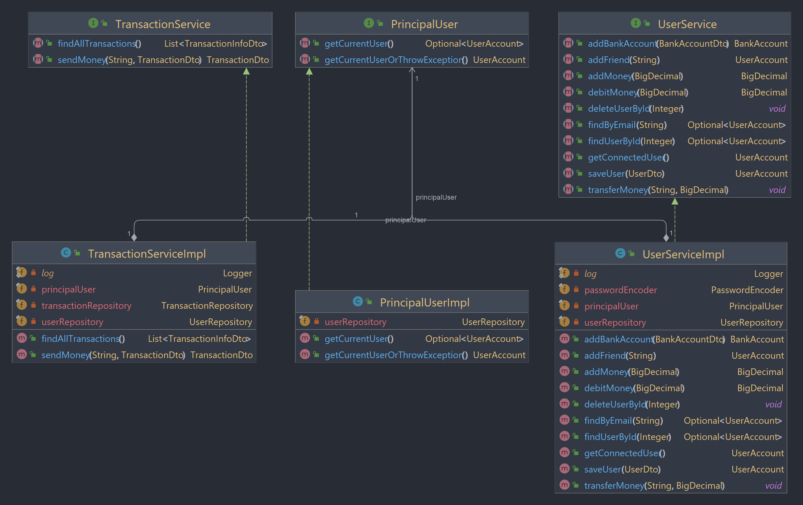

diagramme de classe UML:

--------------------------------------------
Table de ma base de donnée :

--------------------------------------------
Fonctionnement des services :

--------------------------------------------